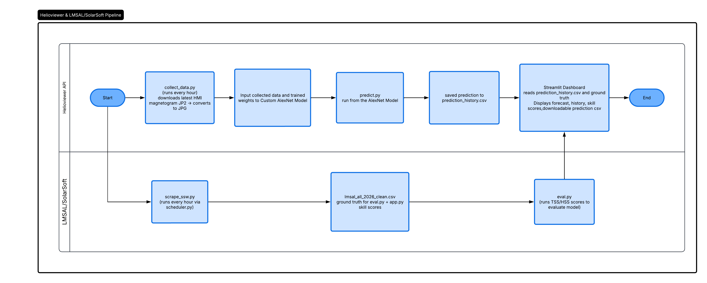

# Operational Verification of Deep Learning–Based Solar Flare Forecasts

A real-time solar flare prediction system I built with Professor Chetraj Pandey and Professor Robin Chataut at **Texas Christian University**. It downloads HMI magnetogram images from the Helioviewer API every hour, classifies them with a custom AlexNet-based deep learning model, and displays live flare-class forecasts with respective probability in a Streamlit dashboard.

---

## Repository Structure

```
solar-flare-forecast/
│
├── app.py                 # Streamlit dashboard
├── style.css              # UI styling
├── collect_data.py        # Data ingestion pipeline
├── collect_latest.py      # latest image fetch
├── scrape_ssw.py          # LMSAL flare data scraper
├── predict.py             # Predictions for all images
├── predict_latest.py      # Prediction for latest image
├── eval.py                # Model evaluation (TSS, HSS score)
├── scheduler.py           # Hourly automation for scrape_ssw.py, collect_data.py, and predict.py
├── prediction_history.csv # Stored predictions
├── lmsal_all_2026_clean.csv # Real flare data
└── new-fold1.pth          # Trained model weights
├── .gitignore
├── requirements.txt
└── README.md
```

---

## System Pipeline
```
How files work and connected to each other. collect_latest.py and predict_latest.py are mainly used for test and retrieve newest detected image and predictions.
```



---

## Setup

### 1. Clone the repo

```bash
git clone https://github.com/hoangthaison2306/solar-flare-forecast.git
cd solar-flare-forecast
```

### 2. Install dependencies

```bash
pip install -r requirements.txt
 ```

### 3. Add the model weights

Place `new-fold1.pth` in the project root. This file is not tracked by git due to its size.

The model uses `Custom_AlexNet` from the [`explainingFullDisk`](https://github.com/chetrajpandey/explainingFullDisk) package. Install or clone it so the import resolves:

```bash
git clone https://github.com/chetrajpandey/explainingFullDisk.git
```

### 4. Download historical images (optional, for bulk evaluation)

```bash
python collect_data.py
```

Downloads hourly HMI magnetograms from Feb 1, 2026 onward and converts them to JPG under `data/hmi_jpg/`.

---

## Running the System

### Start the LMSAL scraper (keep running in background)

```bash
python scheduler.py
```

Runs `scrape_ssw.py` immediately on startup, then every 60 minutes. Keeps `lmsal_all_2026_clean.csv` up to date.

### Run predictions for all historical images

```bash
python predict.py
```
### Fetch the latest solar image + run inference

```bash
python collect_latest.py
python predict_latest.py
```
### Evaluation
Compute TSS and HSS against M/X-class GOES ground truth:
```bash
python eval.py
```
Example output:

```
Period           TSS      HSS
--------------------------------
Last 1 Week   +0.XXXX  +0.XXXX
Last 1 Month  +0.XXXX  +0.XXXX
Last 2 Months +0.XXXX  +0.XXXX
```
**Metric definitions (threshold: probability ≥ 0.5):**
- **TSS** (True Skill Statistic) = POD − FAR. Range [−1, 1]; 0 = no skill.
- **HSS** (Heidke Skill Score) = skill relative to random chance. Range (−∞, 1]; 1 = perfect.

A prediction is a **true positive** if any M or X-class flare starts between `image_time` and `forecast_end` (image time + 12 hours).

---
### Launch the dashboard

```bash
streamlit run app.py
```
---
## Data Sources

| Source | Description |
|--------|-------------|
| [Helioviewer API](https://helioviewer.org) | HMI Line-of-Sight Magnetogram images (sourceId=19), JP2 format |
| [LMSAL / SolarSoft](https://www.lmsal.com/solarsoft/latest_events_archive.html) | GOES flare event catalog |

---

## References

Developed at **Texas Christian University (TCU)**.  
Model architecture based on the [ExplainingFullDisk](https://github.com/chetrajpandey/explainingFullDisk) solar flare forecasting framework.
